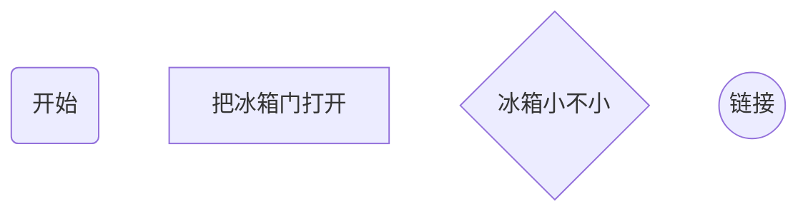
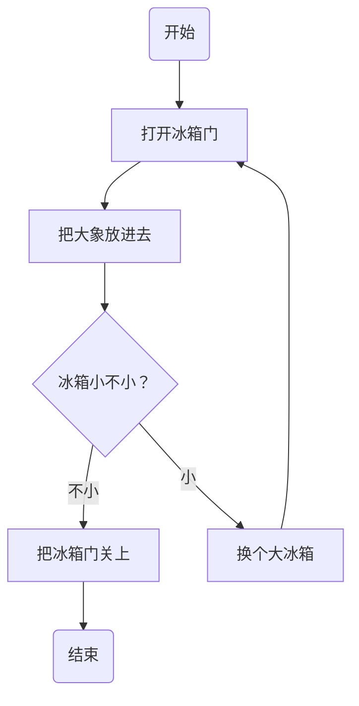

- [一级标题](#一级标题)
  - [二级标题](#二级标题)
    - [三级标题](#三级标题)
      - [四级标题](#四级标题)
        - [五级标题](#五级标题)
          - [六级标题](#六级标题)
- [一级标题](#一级标题-1)
  - [二级标题](#二级标题-1)
    - [段落 {#段落}](#段落-段落)
    - [字体 {#字体}](#字体-字体)
    - [块引用 {#块引用}](#块引用-块引用)
    - [列表 {#列表}](#列表-列表)
    - [代码 {#代码}](#代码-代码)
    - [图片 {#图片}](#图片-图片)
    - [链接 {#链接}](#链接-链接)
    - [转义字符 {#转义字符}](#转义字符-转义字符)
    - [表格 {#表格}](#表格-表格)
    - [脚注 {#脚注}](#脚注-脚注)
    - [表情符号](#表情符号)

### 标题 {#标题}
# 一级标题
## 二级标题
### 三级标题
#### 四级标题
##### 五级标题
###### 六级标题

一级标题
====

二级标题
----


--------
### 段落 {#段落}

这是一个段落
这是段落的第二行

------
### 字体 {#字体}

**粗体文字**

*斜体文字*

***粗体斜体并用***

~~删除线文字~~

-----
### 块引用 {#块引用}

> 这是一个块引用
>
> 多段落块引用，记得在段落中间加一个>

>这是一个嵌套块引用
>
>>这是被嵌套的块引用

> ## 块引用中可以插入其他的元素
> - 但你需要自己尝试能否在块中使用
> - 如无序列表就可以使用
> **粗体**和*斜体*也可以使用

---
### 列表 {#列表}
1. 有序列表
2. 记得要在点后面加空格
3. 有序列表也可以使用其他的符号
4. 也可以嵌套
   1. 有序列表
   2. 嵌套
   3. 有序列表
5. over

- 无序列表
- 也可以使用其他符号创建

* 无序列表

+ 无序列表

+ 嵌套的无序列表
  + 按住Tab键可以嵌套
    + 也可以多层嵌套
      + 但是不要忘记空格
        + 有序列表也可以多层嵌套

- 在保留列表连续性的情况下
- 如果你想添加其他元素
    请将该元素缩进四个空格或者一个制表符Tab
- 这样依然可以保持列表的连续性

**定义列表**

自由度
: 自由度是指在统计学和概率论中，用于衡量样本中独立或自由变动的数量。

T检验
: T检验是一种常用的统计方法，用于比较两个样本均值是否存在显著差异。它基于样本数据计算出一个T值，然后将该T值与T分布进行比较，从而得出结论。

**任务列表**
- [ ] Task1
- [x] Task2


-----

### 代码 {#代码}

`这是一个可以嵌入文本的代码块`

```python
class Solution(object):
    def twoSum(self, nums, target):
        """
        :type nums: List[int]
        :type target: int
        :rtype: List[int]
        """
        for i in range(len(nums)):
            res=target-nums[i]
            if res in nums[i+1:]:
                return [i,nums[i+1:].index(res)+i+1]
```

----
### 图片 {#图片}


- 图片太大

<div align=center></div>

**带连接的图片**

[](https://www.cnblogs.com/1024th/p/11623258.html)

---
### 链接 {#链接}

[AI探索](exploreai.cn "鼠标悬停显示内容")

**网址和电子邮件迅速转为链接**
&#160;
<https://www.markdownguide.org>
<zhangjunhao36@163.com>


强调链接 **[Python](https://www.python.org/)**
斜体链接 *[Python](https://www.python.org/)*
粗体斜体链接 ***[Python](https://www.python.org/)***

**引用式链接**
[Python][1]

[1]: https://www.python.org/ "鼠标悬停显示内容"

---

### 转义字符 {#转义字符}

\*这是一个转义字符\*  
如果没有转义的话，这将是一个斜体表达

---

### 表格 {#表格}

|表格|表格|
|---|---|
|张三|18|
|李四|20|

|A|B|
|:--|--:|
|12|13|

**表格的对齐**

|左对齐|居中对齐|右对齐|
|:---|:---:|---:|
|张三|18|男|
|李四|20|女|

表格中如果需要出现管道符号，可是使用HTML字符编码实现 |(&#124;)

---

### 脚注 {#脚注}

脚注可以是数字[^1],也可以自定义[^zhangsan] 
脚注永远放在文章最后

[^1]: 这是一个脚注
[^zhangsan]: 这是一个自定义脚注

--- 

### 表情符号

`:smile:` :smile:
`:laughing:` :laughing:
`:heart_eyes:` :heart_eyes:
`:dog:` :dog:
[更多表情符号1](https://www.webfx.com/tools/emoji-cheat-sheet/)

[更多表情符号2](https://gist.github.com/rxaviers/7360908)

由于`Markdown`语法不同，表情呈现效果可能不同






