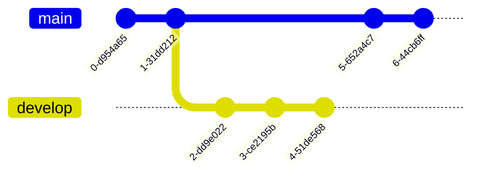

## 图形介绍

### 流程图(Flowchart)

- 流程图由节点(Unicode几何图形列表)和边(箭头或线)组成。`mermaid`定义了节点和边是如何生成的，并且包含了不同的箭头类型、多方向箭头以及任何与子图的链接。


### 时序图 (Sequence diagram)

- 时序图是一个交互图，它显示了各个进程之间是如何运作的，以及它们是以什么顺序运作的。


### 甘特图(Gantt diagram)

- 甘特图是柱状图的一种，首先由卡罗尔 · 阿达米耶茨基(Karol Adamiecki)在1896年开发，然后在1910年代由亨利 · 甘特(Henry Gantt)独立开发，它说明了一个项目的进度表以及任何一个项目完成所需的时间。甘特图说明了终端元素和项目摘要元素的开始日期和完成日期之间的天数。


### 类别图(Class diagram)

- 在软件工程中，统一建模语言中的类图(UML)是一种静态结构图，通过显示系统的类、属性、操作(或方法)以及对象之间的关系来描述系统的结构。


### Git graph

- Git Graph 是 Git 提交和 Git 操作(命令)在不同分支上的图形化表示。



### 实体关系图(Entity Relationship Diagram)

- 实体关系模型(ER 模型)描述了特定知识领域中相互关联的事物。基本 ER 模型由实体类型(对感兴趣的事物进行分类)组成，并指定实体之间可以存在的关系(这些实体类型的实例)


### 用户行程图(User Journey Diagram)

- 用户旅行详细地描述了不同用户在系统、应用程序或网站中完成特定任务所采取的具体步骤。这种技术显示了当前(原样)的用户工作流，并揭示了未来工作流的改进领域。


### 象限图(Quadrant Chart)

- 象限图是分为四个象限的数据的可视化表示。它用于在二维网格上绘制数据点，其中一个变量表示在 x 轴上，另一个变量表示在 y 轴上。象限是通过将图表根据一组特定于所分析数据的标准划分为四个相等的部分来确定的。象限图经常用于识别数据的模式和趋势，并根据图表中数据点的位置确定行动的优先次序。它们通常用于商业、营销和风险管理等领域。


### 状态图(State diagrams)

- 状态图是计算机科学和相关领域中用来描述系统行为的一种图。状态图要求所描述的系统是由有限数量的状态组成的; 有时，情况确实如此，而在其他时候，这是一个合理的抽象。


### 饼图(Pie Chart Diagram)

- 饼图(或圆形图)是一种圆形的统计图形，它被分成若干片来说明数字的比例。在饼图中，每个切片的弧长(因此其中心角度和面积)与它所代表的数量成正比。虽然它的命名是因为它类似于已经切片的馅饼，但是它的呈现方式也有变化。已知最早的饼状图通常要归功于威廉·普莱费尔1801年的《统计简报》


### 需求图(Requirement Diagram)

- 需求图为需求及其相互之间的连接以及其他文档化的元素提供了可视化。建模规范遵循由 SysML v1.6定义的规范。


### 思维导图

- 思维导图: 这是目前的一个实验图。语法和属性可以在以后的版本中更改。语法是稳定的，除了图标集成是实验部分。


### 时间线(Time Diagram)

- 时间轴: 这是目前的实验图。语法和属性可以在以后的版本中更改


### 时序图(ZenUML)

- 时序图是一个交互图，它显示了各个进程之间是如何运作的，以及它们是以什么顺序运作的,这个时序图相比于Sequence Diagram来说功能更多


### Sankey Diagram
- Sankey 图是用于描述从一组值到另一组值的流程的可视化图。


## 教学

### 流程图(Flowchart)

#### 显示方向

---

---


---

#### 节点形状


#### 箭头形状

```mermaid
---
title: 箭头形状
---
graph LR;
A-->B
C---D
E--TEXT---F
E--TEXT-->F
G-.->H
G-.TEXT.->H
I==>J
I==TEXT==>J
K~~~L
a-->b & c-->d
M o--o N
N <--> O
O x--x P
```
#### 子图

```mermaid
graph TB;
C1-->B1
    subgraph one
    A1---B1
    end
    subgraph two
    C1-->C2
    end
```

```mermaid
graph TB;
    subgraph TOP
        subgraph A1
        direction LR
        F1-->F2
        end
        subgraph A2
        direction TB
        B1-->B2
        end
    end
```
```mermaid
graph TB;
  Start(开始)-->Open[打开冰箱门]
  Open --> Put[把大象放进去]
  Put --> IsFit{"冰箱小不小？"}

  IsFit --> |不小|Close[把冰箱门关上]
  Close --> End(结束)

  IsFit --> |小|Change[换个大冰箱]
  Change --> Open
```

```mermaid
---
title: 前端学习路线
---
graph TB;
A[前端]-->html
A-->css
A-->JS
A-->Node.js
A-->Webpack
A-->VUe
VUe-->F
VUe-->B
```
### Journey
```mermaid
journey
    title My weekday
    section Go school
        经济学: 5:Me
        睡觉: 5:Me,Deng
        Access: 3:Me,Deng,X,W
    section Back home
        play cf: 5:Me
        have dinner: 4:Me,Deng
        running:1:Me
```
### Gantt


```mermaid
gantt
    title A Gantt Diagram
    dateFormat YYYY-MM-DD
    section Section
        A task          :a1, 2014-01-01, 30d
        Another task    :after a1, 20d
    section Another
        Task in Another :2014-01-12, 12d
        another task    :24d
```

```mermaid
gantt
    apple :a, 2017-07-20, 1w
    banana :crit, b, 2017-07-23, 1d
    cherry :active, c, after b a, 1d
```

```mermaid
gantt
    dateFormat HH:mm
    axisFormat %H:%M
    Initial milestone : milestone, m1, 17:49, 2m
    Task A : 10m
    Task B : 5m
    Task C :crit,2m
    Final milestone : milestone, m2, 18:08, 4m
```

```mermaid
gantt
    dateFormat  YYYY-MM-DD
    title       Adding GANTT diagram functionality to mermaid
    excludes    weekends
    %% (`excludes` accepts specific dates in YYYY-MM-DD format, days of the week ("sunday") or "weekends", but not the word "weekdays".)

    section A section
    Completed task            :done,    des1, 2014-01-06,2014-01-08
    Active task               :active,  des2, 2014-01-09, 3d
    Future task               :         des3, after des2, 5d
    Future task2              :         des4, after des3, 5d

    section Critical tasks
    Completed task in the critical line :crit, done, 2014-01-06,24h
    Implement parser and jison          :crit, done, after des1, 2d
    Create tests for parser             :crit, active, 3d
    Future task in critical line        :crit, 5d
    Create tests for renderer           :2d
    Add to mermaid                      :1d
    Functionality added                 :milestone, 2014-01-25, 0d

    section Documentation
    Describe gantt syntax               :active, a1, after des1, 3d
    Add gantt diagram to demo page      :after a1  , 20h
    Add another diagram to demo page    :doc1, after a1  , 48h

    section Last section
    Describe gantt syntax               :after doc1, 3d
    Add gantt diagram to demo page      :20h
    Add another diagram to demo page    :48h
```

### 时序图

```mermaid
sequenceDiagram
    Alice->>John: Hello John, how are you?
    John-->>Alice: Great!
    Alice-)John: See you later!
```

```mermaid
sequenceDiagram
    participant Alice
    participant Bob
    Alice->>Bob: Hi Bob
    Bob->>Alice: Hi Alice
```

```mermaid
sequenceDiagram
    actor Alice
    actor Bob
    Alice->>Bob: Hi Bob
    Bob->>Alice: Hi Alice
```

```mermaid
sequenceDiagram
    participant A as Alice
    participant J as John
    A->>J: Hello John, how are you?
    J->>A: Great!
```

```mermaid
sequenceDiagram
    autonumber
    Alice->>John: Hello John, how are you?
    loop Healthcheck
        John->>John: Fight against hypochondria
    end
    Note right of John: Rational thoughts!
    John-->>Alice: Great!
    John->>Bob: How about you?
    Bob-->>John: Jolly good!
```
`markdown`
```mermaid
sequenceDiagram
    critical Establish a connection to the DB
        Service-->DB: connect
    option Network timeout
        Service-->Service: Log error
    option Credentials rejected
        Service-->Service: Log different error
    end
```

