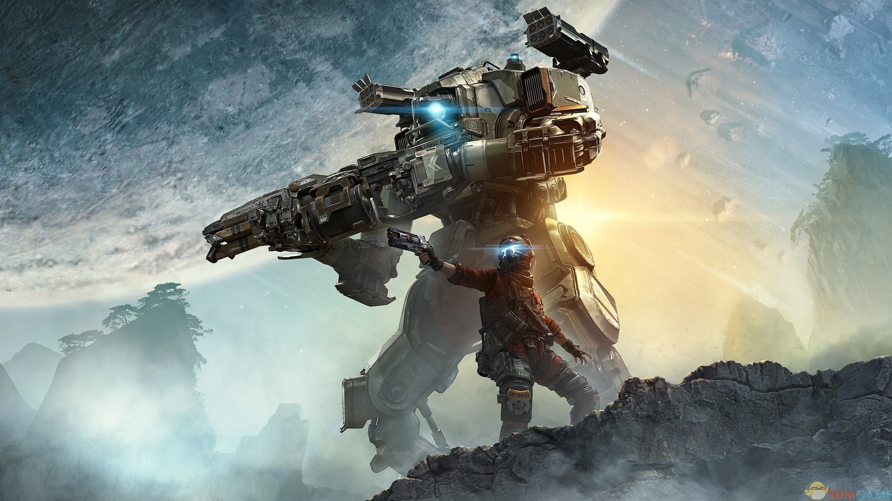

# 泰坦陨落2

## 一. 

## 二. 介绍
> 《Titanfall 2》是由Respawn Entertainment开发并由Electronic Arts发行的一款射击游戏。该游戏于2016年10月28日在PlayStation 4、Xbox One和Microsoft Windows平台上发布。以下是《Titanfall 2》的一些主要特点和玩法要点：
1.单人战役模式： 与第一部相比，《Titanfall 2》增加了单人战役模式，提供了一个深刻的故事，让玩家探索世界观和与机甲（Titan）关联的情节。
2.多人游戏： 《Titanfall 2》依然保留了多人游戏的核心，其中包括玩家与机甲的联动战斗。游戏中有多种不同类型的机甲，每种都具有独特的特点和武器。
3.自定义装备： 玩家可以根据自己的喜好和游戏风格来自定义他们的士兵和机甲。这包括选择不同的武器、附件和机甲技能，以适应各种战斗场景。
4.流畅的运动系统： 《Titanfall 2》注重快节奏和流畅的运动。玩家可以进行墙跑、双跳和快速滑动等动作，使得战斗更加动感和刺激。
5.地图设计： 游戏地图设计丰富多样，包括室内和室外环境，为玩家提供了各种战术选择和策略。
6.协同战斗： 多人游戏中，玩家可以选择与其他队友协同作战，特别是与自己的机甲进行联动，实现更强大的战斗效果。

## 三. 游戏体验和感情共鸣

>1.紧张刺激的战斗体验： 描述游戏中快节奏、紧张刺激的战斗，强调自由奔放的动作，如墙跑、双跳和机甲战斗，营造出一种独特而令人兴奋的游戏体验。
2.机甲与人类的深刻连接： 强调玩家与机甲之间的深刻联系，以及在游戏中体验到的强大机甲技能。这种合作关系不仅仅是战斗工具，还是一个能够共鸣和情感连接的伙伴。
3.单人战役的情感深度： 提及游戏的单人战役模式，突出其深刻的故事情节和对角色的发展。玩家在游戏中将经历一段感人至深的旅程，这种情感体验使得游戏不仅仅是一场战斗，更是一个充满故事和情感的冒险。
4.流畅而自由的运动： 强调游戏中自由流畅的运动系统，包括独特的动作、高速移动和极具创意的战术。这不仅仅让玩家感到掌握了全局，同时也增加了游戏的战术深度。
5.多样化的战术选择： 描述玩家在游戏中可以根据自己的喜好和战术风格选择各种武器、附件和机甲技能，从而创造出属于自己的独特战斗风格。
6.社交和多人互动： 如果适用，可以提及游戏中的多人游戏模式，包括联机对战和合作任务，强调在游戏中与朋友或其他玩家一同体验的乐趣。

## 四. 游戏可玩性和持久性

1.多样化的游戏模式
: 强调游戏中提供的丰富多样的游戏模式，包括单人战役、多人对战、合作任务等。这样的多样性使得游戏能够满足不同类型玩家的需求，增加了游戏的长期吸引力。

2.自定义装备和升级系统
: 介绍游戏中的自定义装备和升级系统，玩家可以根据自己的喜好和战术风格调整角色和机甲。这种个性化的装备选择为玩家提供了持久性的目标，鼓励他们不断尝试新的战术和策略。

3.频繁的更新和支持
:  如果游戏开发团队定期提供更新、新内容和修复漏洞，这将有助于维持游戏的新鲜感和玩家的兴趣。确保提及游戏开发者对于社区的积极互动和支持。

4.竞技性和排名系统
: 如果游戏有竞技性元素或排名系统，可以强调这一点。玩家有机会挑战自己，并与其他玩家竞争，这种竞争性的元素可以增加游戏的持久性。

5.社区活动和赛事
:  如果游戏有定期的社区活动、比赛或赛事，这可以提高玩家的参与度。玩家可以期待特殊奖励、新内容，以及与其他玩家互动的机会。

6.长期发展规划
: 如果游戏开发者有长期发展规划，并且计划引入更多的内容、新地图、新机甲等元素，这有助于表明游戏未来的可玩性。

